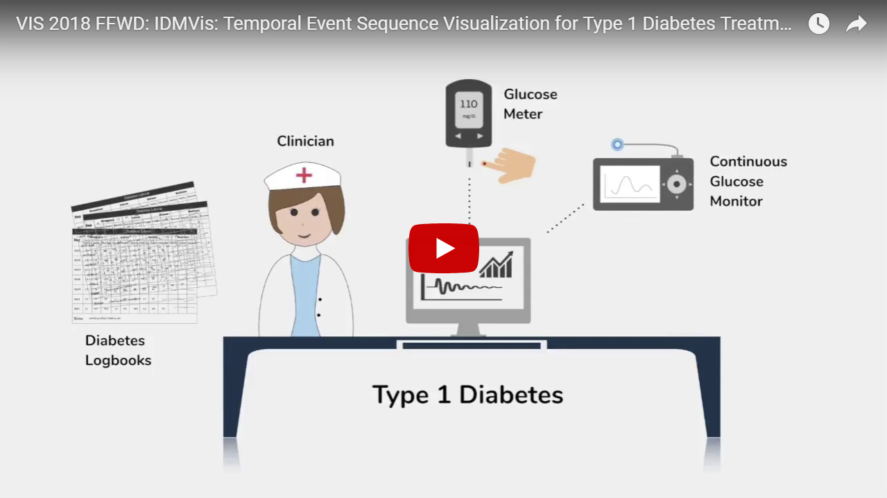
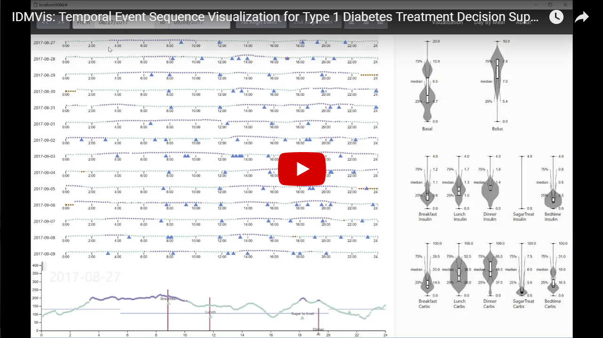
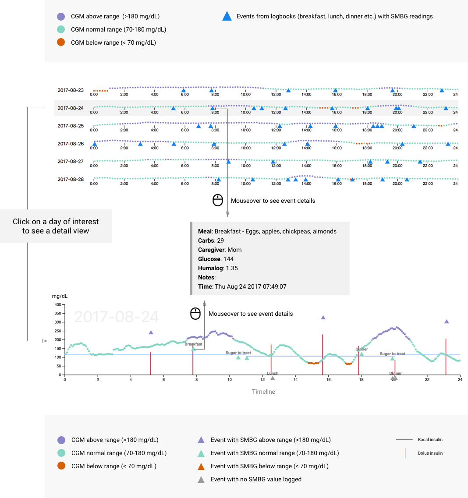

# IDMVis
IDMVis is an open source interactive visualization tool for showing type 1 diabetes patient data. 
It is designed to help clinicians perform temporal inference tasks: 
specifically for recommending adjustments to patient insulin protocol, diet, and behavior. 
IDMVis is built with JavaScript and the [d3.js](https://d3js.org/) library.

# Introductory and Demo Videos
You can see a live demo at [visdunneright.github.io/IDMVis/public/](https://visdunneright.github.io/IDMVis/public/) and watch our 30 second teaser video:

or a five minute demo video:

# Setup
- Open terminal/command prompt.
- Fork and clone [the github repository](https://github.com/VisDunneRight/IDMVis) to your local system in a dedicated folder.
- Change to the public directory.
- At the command line, run python -m http.server with the version Python 3. 
- Visit [http://localhost:8000/](http://localhost:8000/) in your browser.

# Legend

# Publication 

Yixuan Zhang, Kartik Chanana, and Cody Dunne, "[IDMVis: Temporal Event Sequence Visualization forType 1 Diabetes Treatment Decision Support](IDMVis_IEEEVIS18_preprint.pdf)", IEEE Transactions on Visualization and Computer Graphics (Proc. Information Visualization 2017), vol. 25, no. 1, Jan. 2019. doi: [10.1109/TVCG.2018.2865076](https://doi.org/10.1109/TVCG.2018.2865076)

# VIS18 Presentation 
Slides [18VIS slides](IEEEVis_2018_IDMVis.pdf)

# Authors 
[Yixuan Zhang](https://www.ccis.northeastern.edu/people/yixuan-janice-zhang/), [Kartik Chanana](https://www.linkedin.com/in/kartikchanana/), and [Cody Dunne](https://cody.ccis.northeastern.edu/)

Northeastern University [Data Visualization @ CCIS](https://visualization.ccis.northeastern.edu/)

# License
This project is licensed under the MIT License.
